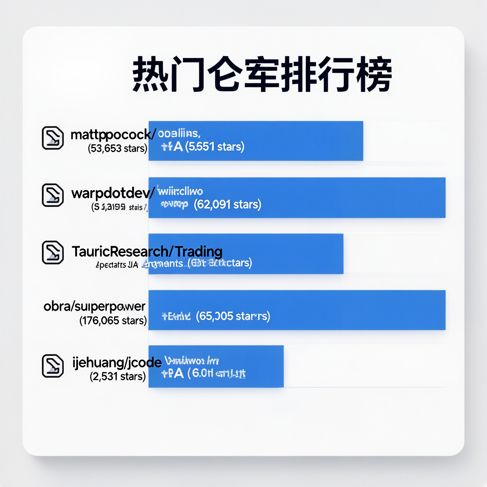
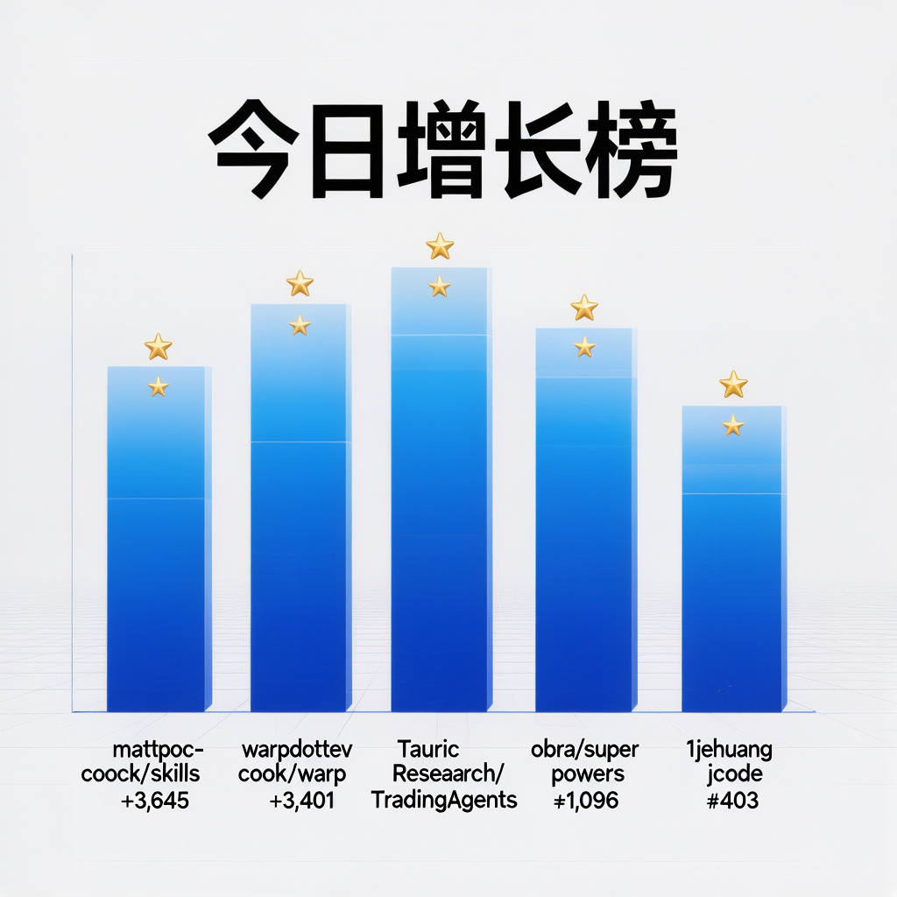
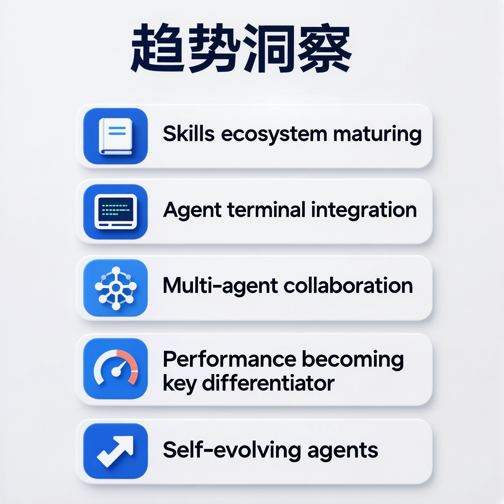

# GitHub Agent热门仓库日报 - 2026-05-02

数据来源：GitHub Trending

## 热门仓库排行榜

| 排名 | 仓库 | Stars | 今日新增 | 核心亮点 |
|------|------|-------|----------|----------|
| 1 | [mattpocock/skills](https://github.com/mattpocock/skills) | 53,653 | +3,645 | 真实工程师的Agent技能集，四大故障模式全攻克 |
| 2 | [warpdotdev/warp](https://github.com/warpdotdev/warp) | 52,091 | +3,401 | Agentic开发环境，终端原生Agent体验 |
| 3 | [TauricResearch/TradingAgents](https://github.com/TauricResearch/TradingAgents) | 60,610 | +2,112 | 多Agent协作的LLM金融交易框架 |
| 4 | [obra/superpowers](https://github.com/obra/superpowers) | 176,065 | +1,096 | 面向AI Agent的技能框架与软件开发方法论 |
| 5 | [1jehuang/jcode](https://github.com/1jehuang/jcode) | 2,531 | +403 | 极致性能编码Agent工具，语义记忆+多Agent协作 |

---

## 详细介绍

### 1. [mattpocock/skills](https://github.com/mattpocock/skills)

Matt Pocock 的 Agent 技能集合，直接来源于 `.claude` 目录。针对四大故障模式（Misalignment/Verbosity/No feedback/Ball of mud）提供系统化解决方案，包含 `/grill-me`、`/tdd`、`/diagnose` 等 16+ 技能。核心理念：软件工程基本功在 AI 时代更重要，技能覆盖从规划到交付的完整开发流程。今日以 3,645 星增量重夺榜首，总量突破 5 万大关。

**GitHub链接**：https://github.com/mattpocock/skills

### 2. [warpdotdev/warp](https://github.com/warpdotdev/warp)

Agentic 开发环境，诞生于终端。Warp 重新定义了终端体验，将 AI Agent 深度融入开发工作流。内置 "Oz" 编码 Agent，支持 Claude Code、Codex、Gemini CLI 等外部 Agent 接入，实现 Issue→Spec→Implement→PR 全自动 Agent 流水线。开源客户端采用 Rust 构建，双许可证模式（MIT + AGPL v3），OpenAI 作为创始赞助商。今日新增 3,401 星，连续多日保持高速增长。

**GitHub链接**：https://github.com/warpdotdev/warp

### 3. [TauricResearch/TradingAgents](https://github.com/TauricResearch/TradingAgents)

多 Agent 协作的 LLM 金融交易框架，模拟真实交易公司运作。分析师团队（基本面、情绪、新闻、技术）→ 研究员团队（看多/看空辩论）→ 交易员决策 → 风控审核 → 组合经理审批。基于 LangGraph 编排，支持 20+ LLM提供商（GPT-5.x、Gemini 3.x、Claude 4.x 等），内置决策日志持久化与检查点恢复。今日新增 2,112 星，总量逼近 6 万，金融 Agent 赛道标杆项目。

**GitHub链接**：https://github.com/TauricResearch/TradingAgents

### 4. [obra/superpowers](https://github.com/obra/superpowers)

经过验证的 Agent 技能框架和软件开发方法论。7 步结构化开发流程：brainstorming → git worktrees → writing plans → subagent-driven development → TDD → code review → finishing branch。核心差异化：技能是强制执行的工作流而非建议，子 Agent 驱动开发，TDD 严格执行（先写测试否则删代码）。支持 7+ 编码 Agent 平台，176,065 星稳居 Agent 领域榜首，Jesse Vincent（RT: Request Tracker 创造者）出品。

**GitHub链接**：https://github.com/obra/superpowers

### 5. [1jehuang/jcode](https://github.com/1jehuang/jcode)

新一代编码 Agent 工具，以极致性能为旗舰差异化。Rust 构建的 TUI 工具，启动速度比竞品快 42-245 倍，内存占用低 5-28 倍。核心特性：语义记忆系统（对话向量嵌入+余弦相似度召回）、Swarm 多 Agent 协作（代码冲突检测+Agent 消息）、自修改模式（Agent 可重写、编译、热加载自身）、30+ LLM 提供商原生 OAuth 支持、内置浏览器自动化。今日新增 403 星，技术路线极具前瞻性。

**GitHub链接**：https://github.com/1jehuang/jcode

---

## 趋势洞察

**Skills 重夺榜首** — mattpocock/skills 今日以 3,645 星增量重回第一，总量突破 5 万，Skills 生态从爆发走向成熟。

**Warp 增速稳定** — 连续多日保持 3,000+ 日增，Agent 终端化趋势明确，开发者工作流正在从"在终端中使用 Agent"转变为"在 Agent 中工作"。

**TradingAgents 逼近 6 万** — 金融 Agent 赛道标杆项目持续攀升，多 Agent 协作架构成为各领域标配。

**superpowers 稳如泰山** — 176K 总星数稳居 Agent 领域第一，方法论驱动的技能框架备受认可。

**性能成为新战场** — jcode 以极致性能切入（42-245 倍启动速度优势），Rust 阵营工具正在重新定义 Agent 工具的性能标准。