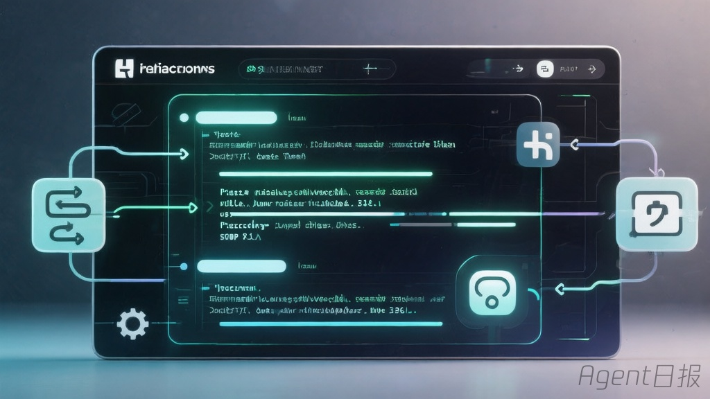
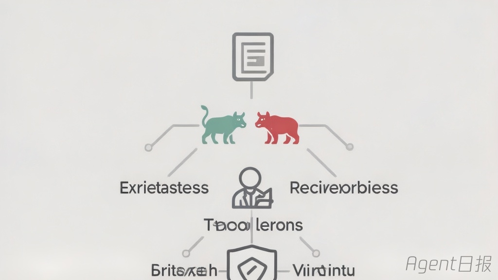
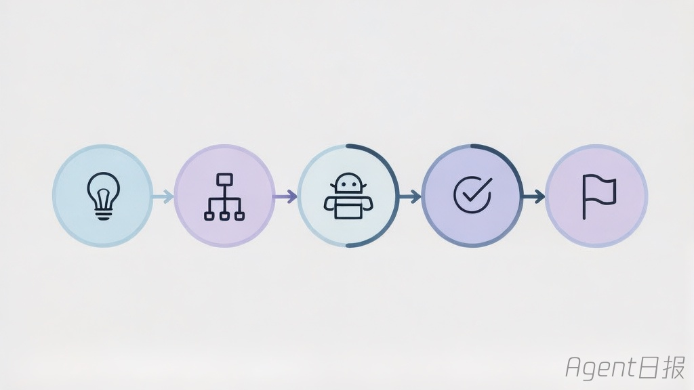
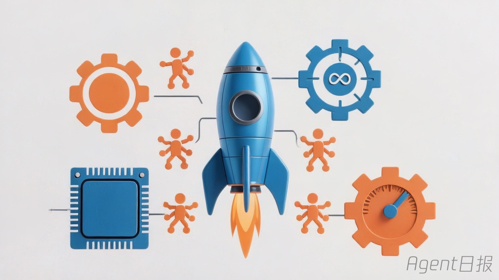

# GitHub Agent热门仓库日报 - 2026-05-02

数据来源：GitHub Trending

| 排名 | 仓库 | Stars | 今日新增 | 核心亮点 |
|------|------|-------|----------|----------|
| 1 | [mattpocock/skills](https://github.com/mattpocock/skills) | 53,531 | +3,645 | 真实工程师的Agent技能集，四大故障模式全攻克 |
| 2 | [warpdotdev/warp](https://github.com/warpdotdev/warp) | 52,034 | +3,401 | Agentic开发环境，终端原生Agent体验 |
| 3 | [TauricResearch/TradingAgents](https://github.com/TauricResearch/TradingAgents) | 60,547 | +2,112 | 多Agent协作的LLM金融交易框架 |
| 4 | [obra/superpowers](https://github.com/obra/superpowers) | 176,021 | +1,096 | 面向AI Agent的技能框架与软件开发方法论 |
| 5 | [1jehuang/jcode](https://github.com/1jehuang/jcode) | 2,517 | +403 | 极致性能编码Agent工具，语义记忆+多Agent协作 |

## 详细介绍

**[mattpocock/skills](https://github.com/mattpocock/skills)** — Matt Pocock 的 Agent 技能集合，直接来源于他的 `.claude` 目录。针对 AI 编码 Agent 的四大故障模式提供 16+ 可组合技能：**/grill-me** 和 **/grill-with-docs** 解决需求对齐问题，**CONTEXT.md** 与 ADR 建立共享领域语言，**/tdd** 红绿重构循环和 **/diagnose** 结构化调试提供反馈机制，**/improve-codebase-architecture** 和 **/zoom-out** 防止代码腐化。核心理念：软件工程基本功在 AI 时代更重要。今日以 3,645 星增量稳居榜首，总量突破 5.3 万。

**[warpdotdev/warp](https://github.com/warpdotdev/warp)** — 诞生于终端的 Agentic 开发环境，Rust 构建（98.2%），今日新增 3,401 星。内置"Oz"编码 Agent，支持 Claude Code、Codex、Gemini CLI 等外部 Agent 接入，实现 Issue→Spec→Implement→PR 全自动 Agentic 工作流。双许可证模式（MIT + AGPL v3），OpenAI 创始赞助。[build.warp.dev](https://build.warp.dev) 提供可视化 Agent 监控面板。连续多日保持高位增长。

**[TauricResearch/TradingAgents](https://github.com/TauricResearch/TradingAgents)** — 多 Agent 协作 LLM 金融交易框架，模拟真实交易公司运作。四支专业团队协作：**分析师团队**（基本面、情绪、新闻、技术分析师）→ **研究团队**（看多/看空研究员辩论）→ **交易员**（综合报告制定决策）→ **风控与组合经理**（评估风险并审批）。支持 20+ LLM 提供商，Apache 2.0 开源，附 [arXiv 论文](https://arxiv.org/abs/2412.20138)。今日新增 2,112 星，总量突破 6 万。

**[obra/superpowers](https://github.com/obra/superpowers)** — 经过真实工程验证的 Agent 技能框架和软件开发方法论，176,021 星稳居 Agent 领域第一。7 步结构化开发流程：头脑风暴→Git Worktrees 隔离→计划拆解→子 Agent 驱动开发→TDD 红绿重构→自动代码审查→分支收尾。核心理念：测试优先、系统化流程胜过临场发挥、简洁为首要目标。支持 Claude Code、Codex、Cursor、Copilot、Gemini CLI、OpenCode 六大平台。

**[1jehuang/jcode](https://github.com/1jehuang/jcode)** — 极致性能编码 Agent Harness，Rust 构建（94.2%），技术路线极具前瞻性。**性能碾压**：启动速度快 42-245 倍，内存占用低 5-28 倍；**语义记忆**：基于向量的自动上下文召回系统；**Swarm 多 Agent 协作**：同仓库多 Agent 自动通知、冲突解决、消息广播；**Self-Dev 模式**：Agent 可修改自身源码实现无限定制；**30+ LLM 提供商**支持 OAuth 登录；内置浏览器自动化和 Mermaid 图表渲染（1800×更快）。今日新增 403 星。

## 趋势洞察

今日 Agent 生态延续高热态势，几个关键趋势值得关注：**Skills 生态持续主导**——mattpocock/skills 重夺榜首，与 obra/superpowers 形成"技能双雄"格局，Agent 技能框架正在从实验走向工程化标准；**终端 Agent 化加速**——Warp 将终端重构为 Agentic 开发环境，连续 5 天保持高增长，预示开发工具链全面 Agent 化；**多 Agent 协作成标配**——TradingAgents 和 jcode 均以多 Agent 协作为核心架构，单一 Agent 已无法满足复杂场景需求；**性能成新战场**——jcode 以极致性能切入，Agent 工具的启动速度和资源占用正成为用户选择的关键指标；**方法论 > 工具**——superpowers 的持续领跑证明，结构化的开发方法论比单纯的功能堆叠更有价值。
